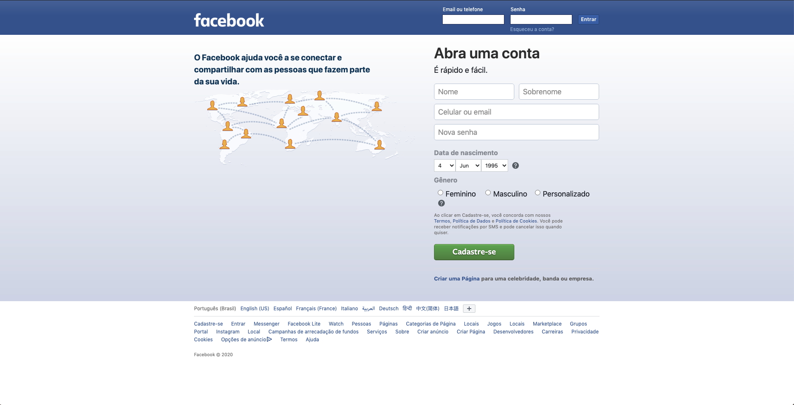

### Termos e acordos

Ao iniciar este projeto, você concorda com as diretrizes do Código de Ética e Conduta e do Manual da Pessoa Estudante da Trybe.

---

# Boas vindas ao repositório do projeto Página de Login do Facebook!

Você já usa o GitHub diariamente para desenvolver os exercícios, certo? Agora, para desenvolver os projetos, você deverá seguir as instruções a seguir. Atenção a cada passo, e se tiver qualquer dúvida, nos envie por _Slack_! #vqv 🚀

Aqui você vai encontrar os detalhes de como estruturar o desenvolvimento do seu projeto à partir desse repositório, utilizando uma branch específica e um _Pull Request_ para colocar seus códigos.

---

## Sumário

- [Habilidades](#habilidades)
- [Entregáveis](#entregáveis)
  - [O que deverá ser desenvolvido](#o-que-deverá-ser-desenvolvido)
  - [Desenvolvimento](#desenvolvimento)
  - [Data de entrega](#data-de-entrega)
- [Instruções para entregar seu projeto](#instruções-para-entregar-seu-projeto)
  - [Antes de começar a desenvolver](#antes-de-começar-a-desenvolver)
  - [Durante o desenvolvimento](#durante-o-desenvolvimento)
  - [Depois de terminar o desenvolvimento (opcional)](#depois-de-terminar-o-desenvolvimento-opcional)
  - [Dicas](#dicas)
- [Como desenvolver](#como-desenvolver)
- [Code Climate](#code-climate)
- [Requisitos do projeto](#requisitos-do-projeto)
- [Lista de requisitos obrigatórios](#lista-de-requisitos-obrigatórios)
  - [1. Crie uma barra azul na parte superior da página](#1-crie-uma-barra-azul-na-parte-superior-da-página)
  - [2. Posicione o logotipo do Facebook no canto esquerdo na barra superior](#2-posicione-o-logotipo-do-facebook-no-canto-esquerdo-na-barra-superior)
  - [3. Adicione um formulário de autenticação no canto direito da barra superior](#3-adicione-um-formulário-de-autenticação-no-canto-direito-da-barra-superior)
  - [4. Crie uma classe no CSS](#4-crie-uma-classe-no-CSS)
  - [5. Adicione um subcontainer para agrupar o rótulo e campo "E-mail ou telefone" dentro do formulário criado na etapa 3](#5-adicione-um-subcontainer-para-agrupar-o-rótulo-e-campo-"E-mail-ou-telefone"-dentro-do-formulário-criado-na-etapa-3)
  - [6. Adicione um subcontainer para agrupar o rótulo e campo "Senha" dentro do formulário criado na etapa 3](#6-adicione-um-subcontainer-para-agrupar-o-rótulo-e-campo-"Senha"-dentro-do-formulário-criado-na-etapa-3)
  - [7. Adicione um subcontainer com o botão "Entrar" dentro do formulário criado na etapa 3](#7-adicione-um-subcontainer-com-o-botão-"Entrar"-dentro-do-formulário-criado-na-etapa-3)
  - [8. Crie um container com a classe main-content abaixo da barra azul para agrupar o conteúdo principal da página](#8-crie-um-container-com-a-classe-main-content-abaixo-da-barra-azul-para-agrupar-o-conteúdo-principal-da-página)
  - [9. Crie um subcontainer para colocar o conteúdo do lado esquerdo](#9-crie-um-subcontainer-para-colocar-o-conteúdo-do-lado-esquerdo)
  - [10. Crie um subcontainer para colocar o conteúdo do lado direito](#10-crie-um-subcontainer-para-colocar-o-conteúdo-do-lado-direito)
  - [11. Crie um campo de entrada de texto para o nome do usuário dentro do formulário criado no requisito 10](#11-crie-um-campo-de-entrada-de-texto-para-o-nome-do-usuário-dentro-do-formulário-criado-no-requisito-10)
  - [12. Crie um campo de entrada de texto para o sobrenome do usuário dentro do formulário criado no requisito 10](#12-crie-um-campo-de-entrada-de-texto-para-o-sobrenome-do-usuário-dentro-do-formulário-criado-no-requisito-10)
  - [13. Crie um campo de entrada de texto para o celular ou email do usuário dentro do formulário criado no requisito 10](#13-crie-um-campo-de-entrada-de-texto-para-o-celular-ou-email-do-usuário-dentro-do-formulário-criado-no-requisito-10)
  - [14. Crie um campo de entrada para senha do usuário dentro do formulário criado no requisito 10](#14-crie-um-campo-de-entrada-para-senha-do-usuário-dentro-do-formulário-criado-no-requisito-10)
  - [15. Crie um campo de entrada para data de nascimento do usuário dentro do formulário criado no requisito 10](#15-crie-um-campo-de-entrada-para-data-de-nascimento-do-usuário-dentro-do-formulário-criado-no-requisito-10)
  - [16. Crie um campo de entrada para gênero do usuário dentro do formulário criado no requisito 10](#16-crie-um-campo-de-entrada-para-gênero-do-usuário-dentro-do-formulário-criado-no-requisito-10)
  - [17. Crie um botão para finalizar o cadastro dentro do formulário criado no requisito 10](#17-crie-um-botão-para-finalizar-o-cadastro-dentro-do-formulário-criado-no-requisito-10)
  - [18. Validar se todos os campos foram preenchidos ao clicar no botão Cadastre-se](#18-validar-se-todos-os-campos-foram-preenchidos-ao-clicar-no-botão-cadastre-se)
  - [19. Adicione um novo campo de texto no formulário se a pessoa usuária selecionar a opção `Personalizado` no campo Gênero](#19-adicione-um-novo-campo-de-texto-no-formulário-se-a-pessoa-usuária-selecionar-a-opção-personalizado-no-campo-gênero)
  - [20. Substitua o conteúdo do container com a classe right-content se o formulário estiver completamente preenchido e validado](#20-substitua-o-conteúdo-do-container-com-a-classe-right-content-se-o-formulário-estiver-completamente-preenchido-e-validado)
  - [Requisito Bônus](#requisito-bônus)
- [Avisos finais](#avisos-finais)

---

## Habilidades

Neste projeto, verificaremos se você é capaz de:

  * Criar formulários em HTML;

  * Utilizar CSS Flexbox para criar layouts flexíveis;

  * Criar regras CSS específicas para serem aplicadas a dispositivos móveis;

  * Construir páginas que alteram o seu layout de acordo com a orientação da tela;

---

## Entregáveis

Para entregar o seu projeto você deverá criar um Pull Request neste repositório.

Lembre-se que você pode consultar nosso conteúdo sobre [Git & GitHub](https://app.betrybe.com/course/fundamentals/git) sempre que precisar!

### O que deverá ser desenvolvido

Neste projeto, você irá desenvolver a página inicial do Facebook. O projeto deve ser o mais parecido possível. Respeitando os requisitos, tente fazer uma cópia perfeita!

### Desenvolvimento

⚠️ É importante que seus arquivos tenham exatamente estes nomes! ⚠️

O seu Pull Request deverá conter os arquivos `index.html`, `style.css` e `script.js`, que conterão seu código HTML, CSS e JavaScript, respectivamente.

Você pode adicionar outros arquivos se julgar necessário. Qualquer dúvida, procure o time de instrução.

### Data de Entrega

  - Será `1` dia de projeto.
  - Data de entrega para avaliação final do projeto: `29/03/2021 - 14:00h`.

---

## Instruções para entregar seu projeto:

### Antes de começar a desenvolver:

1. Clone o repositório
  * `git clone git@github.com:tryber/sd-010-b-project-facebook-signup.git`.
  * Entre na pasta do repositório que você acabou de clonar:
    * `cd sd-010-b-project-facebook-signup`

2. Crie uma branch a partir da branch `master`
  * Verifique que você está na branch `master`
    * Exemplo: `git branch`
  * Se não estiver, mude para a branch `master`
    * Exemplo: `git checkout master`
  * Agora, crie uma branch onde você vai guardar os `commits` do seu projeto
    * Você deve criar uma branch no seguinte formato: `nome-de-usuario-nome-do-projeto`
    * Exemplo: `git checkout -b joaozinho-facebook-project`

3. Crie na raiz do projeto os arquivos que você precisará desenvolver:
  * Verifique que você está na raiz do projeto
    * Exemplo: `pwd` -> o retorno vai ser algo tipo _/Users/joaozinho/code/**sd-010-b-project-facebook-signup**_
  * Crie os arquivos index.html, style.css e script.js
    * Exemplo: `touch index.html style.css script.js`

4. Adicione as mudanças ao _stage_ do Git e faça um `commit`
  * Verifique que as mudanças ainda não estão no _stage_
    * Exemplo: `git status` (devem aparecer listados os novos arquivos em vermelho)
  * Adicione o novo arquivo ao _stage_ do Git
      * Exemplo:
        * `git add .` (adicionando todas as mudanças - _que estavam em vermelho_ - ao stage do Git)
        * `git status` (devem aparecer listados os arquivos em verde)
  * Faça o `commit` inicial
      * Exemplo:
        * `git commit -m 'iniciando o projeto. VAMOS COM TUDO :rocket:'` (fazendo o primeiro commit)
        * `git status` (deve aparecer uma mensagem tipo _nothing to commit_ )

5. Adicione a sua branch com o novo `commit` ao repositório remoto
  * Usando o exemplo anterior: `git push -u origin joaozinho-facebook-project`

6. Crie um novo `Pull Request` _(PR)_
  * Vá até a página de _Pull Requests_ do [repositório no GitHub](https://github.com/tryber/sd-010-b-project-facebook-signup/pulls)
  * Clique no botão verde _"New pull request"_
  * Clique na caixa de seleção _"Compare"_ e escolha a sua branch **com atenção**
  * Clique no botão verde _"Create pull request"_
  * Adicione uma descrição para o _Pull Request_, um título claro que o identifique, e clique no botão verde _"Create pull request"_
  * **Não se preocupe em preencher mais nada por enquanto!**
  * Volte até a [página de _Pull Requests_ do repositório](https://github.com/tryber/sd-010-b-project-facebook-signup/pulls) e confira que o seu _Pull Request_ está criado

---

### Durante o desenvolvimento

* Faça `commits` das alterações que você fizer no código regularmente;

* Lembre-se de sempre após um (ou alguns) `commits` atualizar o repositório remoto;

* Os comandos que você utilizará com mais frequência são:

  1. `git status` _(para verificar o que está em vermelho - fora do stage - e o que está em verde - no stage)_;

  2. `git add` _(para adicionar arquivos ao stage do Git)_;

  3. `git commit` _(para criar um commit com os arquivos que estão no stage do Git)_;

  5. `git push -u nome-da-branch` _(para enviar o commit para o repositório remoto na primeira vez que fizer o `push` de uma nova branch)_;

  4. `git push` _(para enviar o commit para o repositório remoto após o passo anterior)_.

---

### Dicas

- Para colocar sua página no [GitHub Pages](https://pages.github.com/), não é necessário remover o conteúdo que já está lá, você pode apenas adicionar essa nova página. Para isso, todo o conteúdo desse projeto deve ser colocado em uma pasta `/projetos/facebook-signup`.

---

## Como desenvolver

Você irá desenvolver este projeto em **dupla** e é fundamental que siga as instruções do repositório.

Todos os requisitos tem como base a página do **Facebook**. Use a imagem do site, além de acessar [este link com a página antiga de cadastro/login](https://web.archive.org/web/20200101163229if_/https://pt-br.facebook.com/). Tente ser o mais fiel possível.

Use a inspeção de código para verificar a estrutura da página de cadastro/login do **Facebook**.



---

### Observações técnicas:

Algumas coisas devem seguir um padrão pré-estabelecido para que os teste de correção funcionem corretamente.

⚠️ Leia-os atentamente e siga à risca o que for pedido. Em particular, **atente-se para os nomes de _ids_ que alguns elementos de seu projeto devem possuir**. ⚠️

⚠ **Alguns requisitos pedem para utilizar flexbox. Tenha atenção no que é solicitado caso vá usar algum framework CSS para que os requisitos sejam atendidos.** ⚠

O não cumprimento de um requisito, total ou parcialmente, impactará em sua avaliação.

* Os requisitos do seu projeto são avaliados automaticamente, sendo utilizada a resolução de tela de `1366 x 768` (1366 pixels de largura por 768 pixels de altura).

  * #### ⚠️ Logo, recomenda-se desenvolver seu projeto usando a mesma resolução, via instalação [deste plugin](https://chrome.google.com/webstore/detail/window-resizer/kkelicaakdanhinjdeammmilcgefonfh?hl=en) do `Chrome` para facilitar a configuração da resolução. ⚠️

* Atente-se para o tamanho das imagens que você utilizará neste projeto. **Não utilize imagens com um tamanho maior que _500Kb_.**
  * #### ⚠️ Utilize uma ferramenta [como esta](https://picresize.com/pt) para redimensionar as imagens. ⚠️

  * Caso a avaliação falhe com alguma mensagem de erro parecida com `[409:0326/130838.878602:FATAL:memory.cc(22)] Out of memory. size=4194304`, provavelmente as imagens que você está utilizando estão muito grandes. Tente redimensioná-las para um tamanho menor.

* Para verificar se a sua avaliação foi computada com sucesso, você pode verificar os **detalhes da execução do avaliador**.

  * Na página do seu _Pull Request_, acima do "botão de merge", procure por _**"Evaluator job"**_ e clique no link _**"Details"**_;

  * Na página que se abrirá, procure pela linha _**"Cypress evaluator step"**_ e clique nela;

  * Analise os resultados a partir da mensagem _**"(Run Starting)"**_;

  * Caso tenha dúvidas, consulte [este vídeo](https://vimeo.com/420861252) ou procure a monitoria.

* Você tem liberdade para adicionar novos comportamentos ao seu projeto, seja na forma de aperfeiçoamentos em requisitos propostos ou novas funcionalidades, **desde que tais comportamentos adicionais não conflitem com os requisitos propostos**.

  * Em outras palavras, você pode fazer mais do que for pedido, mas nunca menos.

* Contudo, tenha em mente que **nada além do que for pedido nos requisitos será avaliado**. _Esta é uma oportunidade de você exercitar sua criatividade e experimentar com os conhecimentos adquiridos._

---

## ESLint

⚠️ Lembre-se que o seu projeto só será avaliado se estiver passando pelos _checks_ do **ESLint**.

Para garantir a qualidade do código, vamos utilizar neste projeto os linters ESLint e StyleLint. Assim o código estará alinhado com as boas práticas de desenvolvimento, sendo mais legível e de fácil manutenção! Para rodá-los localmente no projeto, execute os comandos abaixo:

```bash
npm run lint
npm run lint:styles
```

Quando é executado o comando npm run lint:styles, será avaliado se os arquivos com a extensão CSS estão com o padrão correto.
Quando é executado o comando npm run lint, será avaliado se os arquivos com a extensão JS e JSX estão com o padrão correto.

---

## Requisitos do projeto

Caso você faça o download de bibliotecas externas, utilize o diretório libs (à partir da raiz do projeto) para colocar os arquivos (*.css, *.js, etc...) baixados.

### Lista de requisitos obrigatórios:

### 1. Crie uma barra azul na parte superior da página

  Pontos importantes:
  * A barra deve ter a classe top-bar
  * A classe top-bar deve determinar que o elemento é um flex container
  * A classe top-bar deve possuir a propriedade `background-color: rgb(66, 103, 178)`


### 2. Posicione o logotipo do Facebook no canto esquerdo na barra superior

  Pontos importantes:
  * Deve existir um elemento img com a classe facebook-logo
  * O logotipo deve estar alinhado a esquerda dentro da barra azul
  * O atributo src do logotipo deve apontar para imgs/facebook-logo.png


### 3. Adicione um formulário de autenticação no canto direito da barra superior

  Pontos importantes:
  * O formulário deve estar alinhado a direita dentro da barra azul
  * Existe formulário com uma classe chamada facebook-login
  * O formulário deve ser um flex container


### 4. Crie uma classe no CSS 

  Pontos importantes:
  * Essa classe deve se chamar form-group
  * Essa classe deve possuir a propriedade `diplay: flex`
  * Alinhe o eixo principal dessa classe para ser o eixo vertical


### 5. Adicione um subcontainer para agrupar o rótulo e campo "E-mail ou telefone" dentro do formulário criado na etapa 3

  Pontos importantes:
  * Este subcontainer deve ter a classe `form-group`
  * Dentro do subcontainer `form-group` criado, deve haver um rótulo com o id user-email-phone-label e o texto "Email ou telefone"
  * Dentro do subcontainer `form-group` criado, abaixo do rótulo deve haver campo de entrada de texto para receber o email ou o telefone do usuário com o id user-email-phone'

### 6. Adicione um subcontainer para agrupar o rótulo e campo "Senha" dentro do formulário criado na etapa 3

  Pontos importantes:
  * Deve haver um novo subcontainer utilizando a classe `form-group`
  * Dentro do novo subcontainer `form-group` criado, deve haver um rótulo com o id user-password-label e o texto "Senha"
  * Dentro do novo subcontainer `form-group` criado, abaixo do rótulo deve haver campo de entrada para senha com o id user-password

### 7. Adicione um subcontainer com o botão "Entrar" dentro do formulário criado na etapa 3

  Pontos importantes:
  * Deve haver um novo subcontainer utilizando a classe `form-control`
  * Crie uma classe no CSS form-control com a propriedade `align-self: flex-end`
  * Dentro do novo subcontainer `form-control` criado, deve haver um botão com o id "button-login" e o texto "Entrar"
  * O botão deve estar alinhado a direita do campo de entrada para senha
  * Ao clicar no botão com o id #button-login deve exibir um alert com o valor do campo "Email ou telefone"

### 8. Crie um container abaixo da barra azul para agrupar o conteúdo principal da página

  Pontos importantes:
  * Crie um elemento com a classe main-content
  * O elemento deve ser um flex container no eixo horizontal
  * O elemento deve posicionado abaixo da barra azul


### 9. Crie um subcontainer para colocar o conteúdo do lado esquerdo

  Pontos importantes:
  * Crie o subcontainer dentro do container com a classe main-content
  * O subcontainer deve ter a classe left-content
  * A classe left-content deve ter uma largura de 800px
  * Dentro do container com a classe left-content deve existir um parágrafo com id facebook-slogan e o texto "O Facebook ajuda você a se conectar e compartilhar com as pessoas que fazem parte da sua vida."
  * Dentro do container com a classe left-content deve existir abaixo do parágrafo com id facebook-slogan uma imagem com id facebook-networking e o src com o endereço `imgs/networking.png`.


### 10. Crie um subcontainer para colocar o conteúdo do lado direito

  Pontos importantes:
  * Crie o subcontainer dentro do container com a classe main-content
  * O novo subcontainer deve ter a classe right-content
  * A classe right-content deve ter uma largura de 300px
  * Utilize na classe main-content a propriedade justify-content com o valor mais apropriado para alinhar os conteúdos
  * Dentro do subcontainer com a classe right-content deve existir um elemento h1 com o texto "Abra uma conta"
  * Dentro do subcontainer com a classe right-content deve existir um elemento com a classe quick-easy com o texto "É rápido e fácil." posicionado abaixo do texto "Abra uma conta"
  * Dentro do subcontainer com a classe right-content deve existir um elemento form abaixo do texto "É rápido e fácil."
  * O elemento com a classe right-content deve estar a direita do elemento com a classe left-content


### 11. Crie um campo de entrada de texto para o nome do usuário dentro do formulário criado no requisito 10

  Pontos importantes:
  * O campo deve ter o atributo name com o valor "firstname"
  * O campo deve ter um placeholder com o valor "Nome"


### 12. Crie um campo de entrada de texto para o sobrenome do usuário dentro do formulário criado no requisito 10
  Pontos importantes:
  * O campo deve ter o atributo name com o valor "lastname"
  * O campo deve ter um placeholder com o valor "Sobrenome"
  * Esse campo deve estar alinhado a direita do campo de Nome


### 13. Crie um campo de entrada de texto para o celular ou email do usuário dentro do formulário criado no requisito 10

  Pontos importantes:
  * O campo deve ter o atributo name com o valor "phone_email"
  * O campo deve ter um placeholder com o valor "Celular ou email"
  * Posicione esse campo abaixo do campo do nome do usuário


### 14. Crie um campo de entrada para senha do usuário dentro do formulário criado no requisito 10

  Pontos importantes:
  * O campo deve ter o atributo name com o valor "password"
  * O campo deve ser do tipo "password"
  * O campo deve ter um placeholder com o valor "Nova senha"
  * Posicione esse campo abaixo do celular/email


### 15. Crie um campo de entrada para data de nascimento do usuário dentro do formulário criado no requisito 10

  Pontos importantes:
  * Um rótulo abaixo do campo nova senha com o id label-birthdate e o texto "Data de nascimento"
  * O campo deve ter o atributo name com o valor "birthdate"
  * O campo deve ser do tipo "text"
  * O campo deve ter um placeholder com o valor "dd/mm/aaaa"
  * Posicione esse campo abaixo do rótulo


### 16. Crie um campo de entrada para gênero do usuário dentro do formulário criado no requisito 10

  Pontos importantes:
  * Um rótulo abaixo do campo nova senha com o id label-gender e o texto "Gênero"
  * O campo deve ser formado por três `radio buttons` com as opções "Feminino", "Masculino" e "Personalizado"
  * Os `radio buttons` devem ter o atributo name com o valor "gender"
  * Posicione os radio buttons para ficar na mesma linha
  * Posicione os radio buttons para ficar abaixo do label

### 17. Crie um botão para finalizar o cadastro dentro do formulário criado no requisito 10

  Pontos importantes:
  * Um botão com o texto "Cadastre-se" e id "facebook-register"
  * Deve ter a propriedade type igual a submit


### 18. Validar se todos os campos foram preenchidos ao clicar no botão Cadastre-se

  Pontos importantes:
  * Exibir uma mensagem "Campos inválidos" dentro do formulário caso pelo menos um campo não esteja preenchido

### 19. Adicione um novo campo de texto no formulário se a pessoa usuária selecionar a opção `Personalizado` no campo Gênero

  Pontos importantes:
  * O novo campo dever ser uma campo de texto com o atributo name "gender-custom" e um placeholder "Gênero (opcional)"
  * O novo campo deve estar posicionado entre as opções de gênero e o botão "Cadastrar-se"

### 20. Substitua o conteúdo do container com a classe right-content se o formulário estiver completamente preenchido e validado

  Pontos importantes:
  * Deve haver um texto no modelo "Olá, Jonh Doe" (substitua John Doe pelo nome e sobrenome preenchido no formulário)
  * Exibir o e-mail ou telefone
  * Não exibir a senha
  * Exibir a data de nascimento
  * Caso a opção selecionada no campo Gênero seja Feminino exibir "Feminino"
  * Caso a opção selecionada no campo Gênero seja Masculino exibir "Masculino"
  * Caso a opção selecionada no campo Gênero seja Personalizado exibir "Personalizado":

### Requisito Bônus

Esse requisito **não** é verificável pelo avaliador automático.

**Realize o desenvolvimento da versão mobile do Facebook.**


---
### Depois de terminar o desenvolvimento

Para sinalizar que o seu projeto está pronto para o _"Code Review"_ dos seus colegas, faça o seguinte:

* Vá até a página **DO SEU** _Pull Request_, adicione a label de _"code-review"_ e marque seus colegas:

  * No menu à direita, clique no _link_ **"Labels"** e escolha a _label_ **code-review**;

  * No menu à direita, clique no _link_ **"Assignees"** e escolha **o seu usuário**;

  * No menu à direita, clique no _link_ **"Reviewers"** e digite `students`, selecione o time `tryber/students-sd-010-b`.

Caso tenha alguma dúvida, [aqui tem um vídeo explicativo](https://vimeo.com/362189205).

---

### Revisando um pull request

À medida que você e as outras pessoas que estudam na Trybe forem entregando os projetos, vocês receberão um alerta via Slack para também fazer a revisão dos Pull Requests das outras pessoas estudantes. Atenção às mensagens do "Pull Reminders" no Slack!

Use o material que você já viu sobre [Code Review](https://course.betrybe.com/real-life-engineer/code-review/) para te ajudar a revisar os projetos que chegaram para você.


# Avisos finais

Ao finalizar e submeter o projeto, não se esqueça de avaliar sua experiência preenchendo o formulário. Leva menos de 3 minutos!

Link: [FORMULÁRIO DE AVALIAÇÃO DE PROJETO](https://bit.ly/3ta7hA0)

O avaliador automático não necessariamente avalia seu projeto na ordem em que os requisitos aparecem no readme. Isso acontece para deixar o processo de avaliação mais rápido. Então, não se assuste se isso acontecer, ok?

---
