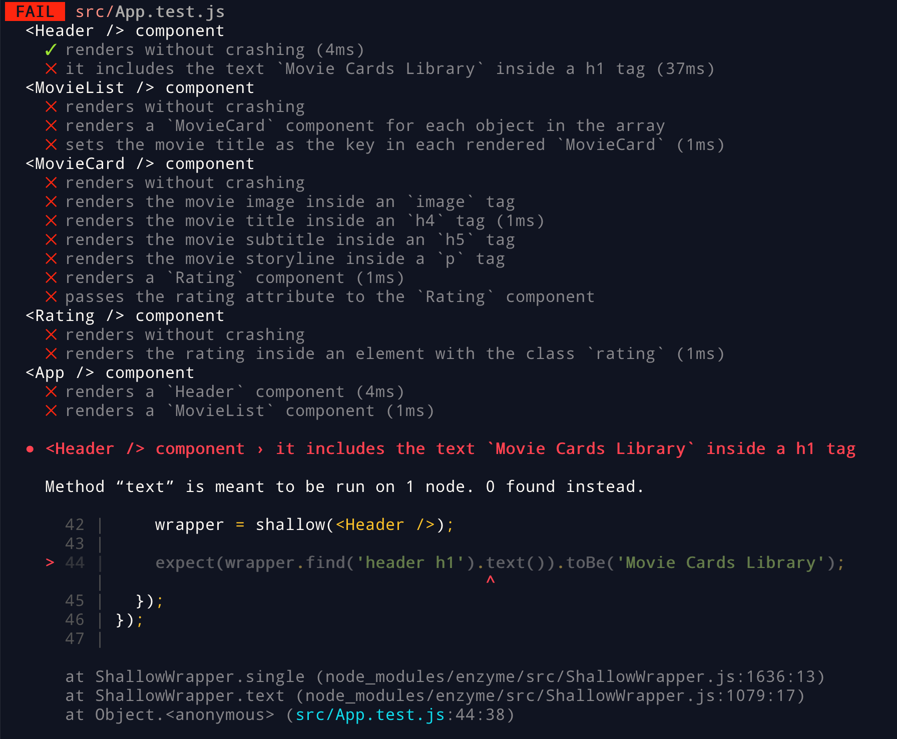
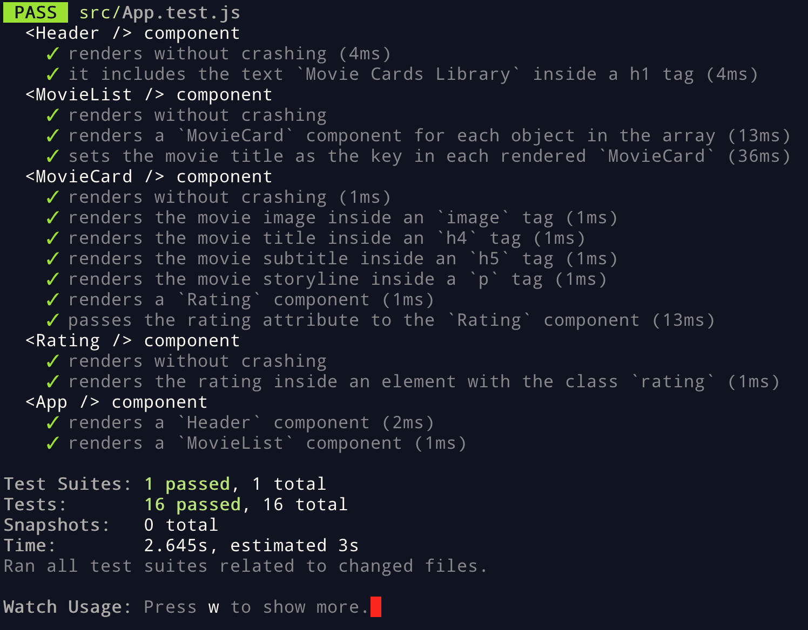

### Termos e acordos

Ao iniciar este projeto, você concorda com as diretrizes do Código de Ética e Conduta e
do Manual da Pessoa Estudante da Trybe.

# Boas vindas ao repositório do projeto de Movie Cards Library Stateful!

Você já usa o GitHub diariamente para desenvolver os exercícios, certo? Agora, para desenvolver os projetos, você deverá seguir as instruções a seguir. Fique atento a cada passo, e se tiver qualquer dúvida, nos envie por _Slack_! #vqv 🚀

Aqui você vai encontrar os detalhes de como estruturar o desenvolvimento do seu projeto a partir deste repositório, utilizando uma branch específica e um _Pull Request_ para colocar seus códigos.
F

# Sumário

- [Habilidades](#habilidades)
- [Entregáveis](#entregáveis)
  - [O que deverá ser desenvolvido](#o-que-deverá-ser-desenvolvido)
  - [Desenvolvimento](#desenvolvimento)
  - [Data de entrega](#data-de-entrega)
- [Instruções para entregar seu projeto](#instruções-para-entregar-seu-projeto)
  - [Antes de começar a desenvolver](#antes-de-começar-a-desenvolver)
  - [Durante o desenvolvimento](#durante-o-desenvolvimento)
- [Como desenvolver](#como-desenvolver)
  - [Componentes](#componentes)
  - [Estado de componentes](#estado-de-componentes)
  - [Linter](#linter)
  - [Testes](#testes)
    - [Dica: desativando testes](#dica-desativando-testes)
    - [Dica: watch mode](#dica-watch-mode)
- [Requisitos do projeto](#requisitos-do-projeto)
    - [1 - Crie um componente chamado `<SearchBar />`](#1---crie-um-componente-chamado-searchbar-)
    - [2 - Renderize um formulário dentro de `<SearchBar />`](#2---renderize-um-formulário-dentro-de-searchbar-)
    - [3 - Renderize um input do tipo texto dentro do formulário em `<SearchBar />`](#3---renderize-um-input-do-tipo-texto-dentro-do-formulário-em-searchbar-)
    - [4 - Renderize um input do tipo checkbox dentro do formulário em `<SearchBar />`](#4---renderize-um-input-do-tipo-checkbox-dentro-do-formulário-em-searchbar-)
    - [5 - Renderize um select dentro do formulário em `<SearchBar />`](#5---renderize-um-select-dentro-do-formulário-em-searchbar-)
    - [6 - Crie um componente chamado `<AddMovie />`](#6---crie-um-componente-chamado-addmovie-)
    - [7 - Renderize um formulário dentro de `<AddMovie />`](#7---renderize-um-formulário-dentro-de-addmovie-)
    - [8 - Renderize um input do tipo texto dentro do formulário em `<AddMovie />` para obter o título do novo filme](#8---renderize-um-input-do-tipo-texto-dentro-do-formulário-em-addmovie--para-obter-o-título-do-novo-filme)
    - [9 - Renderize um input do tipo texto dentro do formulário em `<AddMovie />` para obter o subtítulo do novo filme](#9---renderize-um-input-do-tipo-texto-dentro-do-formulário-em-addmovie--para-obter-o-subtítulo-do-novo-filme)
    - [10 - Renderize um input do tipo texto dentro do formulário em `<AddMovie />` para obter o caminho da imagem do novo filme](#10---renderize-um-input-do-tipo-texto-dentro-do-formulário-em-addmovie--para-obter-o-caminho-da-imagem-do-novo-filme)
    - [11 - Renderize uma `textarea` dentro do formulário em `<AddMovie />` para obter a sinopse do novo filme](#11---renderize-uma-textarea-dentro-do-formulário-em-addmovie--para-obter-a-sinopse-do-novo-filme)
    - [12 - Renderize um `input` do tipo `number` dentro do formulário em `<AddMovie />` para obter a avaliação do novo filme](#12---renderize-um-input-do-tipo-number-dentro-do-formulário-em-addmovie--para-obter-a-avaliação-do-novo-filme)
    - [13 - Renderize um `select` do formulário em `<AddMovie />` para selecionar o gênero do novo filme](#13---renderize-um-select-do-formulário-em-addmovie--para-selecionar-o-gênero-do-novo-filme)
    - [14 - Renderize um botão do formulário em `<AddMovie />` para fazer uso dos dados do novo filme, contidos no estado de `<AddMovie />`](#14---renderize-um-botão-do-formulário-em-addmovie--para-fazer-uso-dos-dados-do-novo-filme-contidos-no-estado-de-addmovie)
    - [15 - Crie um componente chamado `<MovieLibrary />`](#15---crie-um-componente-chamado-movielibrary-)
    - [16 - Configure o estado inicial do componente `<MovieLibrary />`](#16---configure-o-estado-inicial-do-componente-movielibray-)
    - [17 - Renderize `<SearchBar />` dentro de `<MovieLibrary />`](#17---renderize-searchbar-dentro-de-movielibrary-)
    - [18 - Renderize `<MovieList />` dentro de `<MovieLibrary />`](#18---renderize-movielist--dentro-de-movielibrary-)
    - [19 - Renderize `<AddMovie />` dentro de `<MovieLibrary />`](#19---renderize-addmovie-dentro-de-movielibrary-)
    - [20 - Adicione proptypes a todos os componentes](#20---adicione-proptypes-a-todos-os-componentes)
- [Depois de terminar o desenvolvimento](#depois-de-terminar-o-desenvolvimento)
- [Revisando um pull request](#revisando-um-pull-request)
- [Avisos Finais](#avisos-finais)

# Habilidades

Nesse projeto, você será capaz de:
  - Ler o estado de um componente e usá-lo para alterar o que exibimos no browser
  - Inicializar um componente, dando a ele um estado pré-definido
  - Atualizar o estado de um componente
  - Capturar eventos utilizando a sintaxe do React
  - Criar formulários utilizando sintaxe JSX com as tags : `input`, `textarea`, `select`, `form`
  - Transmitir informações de componentes filhos para componentes pais via callbacks

# Entregáveis

Para entregar o seu projeto você deverá criar um Pull Request neste repositório.

Lembre-se que você pode consultar nosso conteúdo sobre
[Git & GitHub](https://course.betrybe.com/intro/git/) sempre que precisar!

---

## O que deverá ser desenvolvido

Você deverá desenvolver uma aplicação que consiste em uma biblioteca de cartões de filmes dinâmica utilizando React. A biblioteca é composta por:

* Um cabeçalho;

* Uma barra de busca, utilizada pra filtrar quais cartões serão exibidos na lista de cartões;

* Uma lista de cartões, onde cada cartão representa um filme e possui uma imagem, título, subtítulo, sinopse e avaliação;

* Um formulário para adicionar um novo cartão na biblioteca.

Uma possível implementação dessa biblioteca consta abaixo.


Você precisará implementar componentes que em conjunto resultarão na biblioteca de cartões de filmes dinâmica.

## Desenvolvimento

Desenvolva uma aplicação **React** que seja composta por um `conjunto de componentes` React e
controlada por estados.

## Data de entrega

  - Serão `2` dias de projeto.
  - Data de entrega para avaliação final do projeto: `11/05/2021 - 14:00h`.

# Instruções para entregar seu projeto

## Antes de começar a desenvolver

1. Clone o repositório
  * `git clone https://github.com/tryber/sd-010-b-project-movie-cards-library-stateful.git`.
  * Entre na pasta do repositório que você acabou de clonar:
    * `cd sd-010-b-project-movie-cards-library-stateful`

2. Instale as dependências, inicialize o projeto e rode os testes
  * Instale as dependências:
    * `npm install`
  * Inicialize o projeto:
    * `npm start` (uma nova página deve abrir no seu navegador com um texto simples)
  * Verifique que os testes estão executando:
    * `npm test` (os testes devem rodar e falhar)

3. Crie uma branch a partir da branch `master`
  * Verifique que você está na branch `master`
    * Exemplo: `git branch`
  * Se não estiver, mude para a branch `master`
    * Exemplo: `git checkout master`
  * Agora, crie uma branch onde você vai guardar os `commits` do seu projeto
    * Você deve criar uma branch no seguinte formato: `nome-de-usuario-nome-do-projeto`
    * Exemplo: `git checkout -b joaozinho-movie-cards-library-stateful`

4. Faça alterações em algum dos componentes que precisam de implementação, por exemplo o `<MovieLibrary />` em `src/components`:
```jsx
import React, { Component } from 'react';

import MovieList from './MovieList';
import SearchBar from './SearchBar';
import AddMovie from './AddMovie';

class MovieLibrary extends Component {
  constructor(props) {
    super(props);
  }

  render() {
    return (
      <div>
        <h2> My awesome movie library </h2>
        <SearchBar />
        <MovieList movies={this.props.movies} />
        <AddMovie />
      </div>
    );
  }
}

export default MovieLibrary;
```

5. Adicione as mudanças ao _stage_ do Git e faça um `commit`
  * Verifique que as mudanças ainda não estão no _stage_
    * Exemplo: `git status` (deve aparecer listado o arquivo _src/components/MovieLibrary.jsx_ em vermelho)
  * Adicione o arquivo alterado ao _stage_ do Git
      * Exemplo:
        * `git add .` (adicionando todas as mudanças - _que estavam em vermelho_ - ao stage do Git)
        * `git status` (deve aparecer listado o arquivo _src/components/MovieLibrary.jsx_ em verde)
  * Faça o `commit` inicial
      * Exemplo:
        * `git commit -m 'iniciando o projeto. VAMOS COM TUDO :rocket:'` (fazendo o primeiro commit)
        * `git status` (deve aparecer uma mensagem tipo _nothing to commit_ )

6. Adicione a sua branch com o novo `commit` ao repositório remoto
  * Usando o exemplo anterior: `git push -u origin joaozinho-movie-cards-library-stateful`

7. Crie um novo `Pull Request` _(PR)_
  * Vá até a página de _Pull Requests_ do [repositório no GitHub](https://github.com/tryber/sd-010-b-project-movie-cards-library-stateful/pulls)
  * Clique no botão verde _"New pull request"_
  * Clique na caixa de seleção _"Compare"_ e escolha a sua branch **com atenção**
  * Clique no botão verde _"Create pull request"_
  * Adicione uma descrição para o _Pull Request_ e clique no botão verde _"Create pull request"_
  * **Não se preocupe em preencher mais nada por enquanto!**
  * Volte até a [página de _Pull Requests_ do repositório](https://github.com/tryber/sd-010-b-project-movie-cards-library-stateful/pulls) e confira que o seu _Pull Request_ está criado

---

## Durante o desenvolvimento

* ⚠ **PULL REQUESTS COM ISSUES NO LINTER NÃO SERÃO AVALIADAS, ATENTE-SE PARA RESOLVÊ-LAS ANTES DE FINALIZAR O DESENVOLVIMENTO!** ⚠

* Faça `commits` das alterações que você fizer no código regularmente

* Lembre-se de sempre após um (ou alguns) `commits` atualizar o repositório remoto

* Os comandos que você utilizará com mais frequência são:
  1. `git status` _(para verificar o que está em vermelho - fora do stage - e o que está em verde - no stage)_
  2. `git add` _(para adicionar arquivos ao stage do Git)_
  3. `git commit` _(para criar um commit com os arquivos que estão no stage do Git)_
  4. `git push -u nome-da-branch` _(para enviar o commit para o repositório remoto na primeira vez que fizer o `push` de uma nova branch)_
  5. `git push` _(para enviar o commit para o repositório remoto após o passo anterior)_

---

# Como desenvolver

Este repositório já contém um _template_ com um App React criado e configurado. Após clonar o projeto e instalar as dependências (mais sobre isso abaixo), você não precisará realizar nenhuma configuração adicional. Você deverá completar este _template_ implementando os requisitos listados na próxima seção.

---

## Componentes

Esse projeto contém os seguintes `React Components`:

   - Header
   - MovieLibrary
   - SearchBar
   - MovieList
   - MovieCard
   - Rating
   - AddMovie

`<Header />`, `<MovieList />`, `<MovieCard />` e `<Rating />` **já estão implementados com os testes passando**. `<MovieLibrary />`, `<SearchBar />` e `<AddMovie />` já estão criados, mas precisam ser implementados de forma a passarem nos requisitos listados abaixo.

Todos os componentes devem ser criados dentro da pasta `src/components`. **É obrigatório que seus componentes tenham exatamente os nomes listados acima**.

---

## Estado de componentes

Os componentes que **precisam** ter estado a ser gerenciado são:

   - MovieLibrary
   - AddMovie

---

## Linter

Para garantir a qualidade do código, vamos utilizar neste projeto os linters `ESLint` e `StyleLint`.
Assim o código estará alinhado com as boas práticas de desenvolvimento, sendo mais legível
e de fácil manutenção! Para roda-los localmente no projeto, execute os comandos abaixo:

```bash
npm run lint
npm run lint:styles
```

⚠️ **PULL REQUESTS COM ISSUES DE LINTER NÃO SERÃO AVALIADAS.
ATENTE-SE PARA RESOLVÊ-LAS ANTES DE FINALIZAR O DESENVOLVIMENTO!** ⚠️

---

## Testes

Todos os requisitos do projeto serão testados **automaticamente**. Cada componente possui vários requisitos e os testes para cada requisito de um componente estão no arquivo de teste correspondente.

_**Por exemplo**: Os requisitos relacionados ao componente `<SearchBar />` estão no arquivo `SearchBar.test.js`._

Separe um tempo para ler estes arquivos e entender como os testes estão organizados.

Para executar os testes localmente, digite no terminal o comando `npm test`. Inicialmente, seus testes estarão assim:


A primeira parte da saída mostra um sumário de cada teste e seu status. Um ❌ representa um teste falhando, enquanto um ✅ representa um teste correto. Naturalmente, todos os testes dos componentes que não estiverem implementados, estarão falhando.

Abaixo do sumário, para cada teste falhando, há uma mensagem explicativa sobre o motivo que causou a falha do teste, assim como a linha em que a falha ocorreu. Na imagem, vemos que o teste falha porque o componente `Header`, utilizado na linha 38, não está definido.

Por exemplo, se fizermos uma implementação simples do componente `<Header />`, que não renderiza nada:

```jsx
import React from 'react';

class Header extends React.Component {
  render() {
  }
}

export default Header;
```

E nesse caso descomentarmos a linha que importa o componente `<Header />` em `App.test.js`:

```js
// import App from './App';
import Header from './components/Header';
// import MovieCard from './components/MovieCard';
// import MovieList from './components/MovieList';
// import Rating from './components/Rating';
```

Veremos que o primeiro teste agora passa:



Quando seu projeto estiver terminado, todos os testes deverão estar passando:



**Atenção:** Fique atento, nesse projeto cada componente possui seu próprio arquivo de teste e nada precisa ser descomentado.

---

### Dica: desativando testes

Especialmente no início, quando a maioria dos testes está falhando, a saída após executar os testes é bastante poluída. Você pode desabilitar temporariamente um teste utilizando a função `skip` junto à função `it`. Como o nome indica, esta função "pula" um teste:

```js
it.skip('it includes the text `Movie Cards Library` inside a h1 tag', () => {
  wrapper = shallow(<Header />);

  expect(wrapper.find('header h1').text()).toBe('Movie Cards Library');
});
```

Na saída da execução dos testes, você verá um  indicando que o teste está sendo pulado:


Uma estratégia é pular todos os testes no início e ir implementando um teste de cada vez, removendo dele a função `skip`.

Você também pode rodar apenas um arquivo de teste, por exemplo:

```bash
npm test SearchBar.test.js
```

⚠️ Lembre-se de não entregar o projeto com nenhum teste ignorado. **Testes ignorados serão tratados como testes falhando**. ⚠️

⚠️ **Não apague, em hipótese alguma, qualquer teste ou arquivo deste repositório**. ⚠️

---

### Dica: watch mode

Ao executar os testes localmente, [Jest](https://jestjs.io/), a ferramenta que executa os testes, entra em _watch mode_. Nesse modo, a cada vez que um arquivo é salvo, os testes são executados novamente. Isso pode aumentar sua produtividade removendo a necessidade de executar os testes manualmente o tempo todo. Você pode abrir uma aba no seu terminal ou no terminal do _VSCode_ e deixar o _Jest_ rodando nesse modo.

⚠️  **Este trabalho contém alguns testes de componente não relacionados diretamente a requisitos! Estude-os e use-os para se orientar durante o desenvolvimento, garantindo que estejam sempre passando** ✅! ⚠️

---

# Requisitos do projeto

⚠️ Lembre-se que o seu projeto só será avaliado se estiver passando por **todos os _checks_** do **Linter**⚠️

### 1 - Crie um componente chamado `<SearchBar />`

Esse componente renderizará uma barra com filtros acima da listagem de cartões. Quais cartões serão mostrados no componente `<MovieList />` dependerá dos filtros escolhidos. `<SearchBar />` deve receber como props:

  - `searchText`, uma string
  - `onSearchTextChange`, uma callback
  - `bookmarkedOnly`, um boolean
  - `onBookmarkedChange`, uma callback
  - `selectedGenre`, uma string
  - `onSelectedGenreChange`, uma callback

**O que será verificado:**
  - Será validado se o componente `<SearchBar />`, recebendo as devidas props, renderiza com sucesso


### 2 - Renderize um formulário dentro de `<SearchBar />`

Dentro desse formulário haverá campos usados na filtragem de cartões.

- Esse formulário deve apresentar o atributo `data-testid="search-bar-form"`

**O que será verificado:**
  - Será validado se é renderizado 1, e apenas 1, form dentro de `<SearchBar />`


### 3 - Renderize um input do tipo texto dentro do formulário em `<SearchBar />`

- O input deve ter uma label associada com o texto: **"Inclui o texto:"**;

- Essa label deve apresentar o atributo `data-testid="text-input-label"`

- A propriedade `value` do input deve receber o valor da prop `searchText`;

- A propriedade `onChange` do input deve receber o valor da prop `onSearchTextChange`.

- Esse input deve apresentar o atributo `data-testid="text-input"`

**O que será verificado:**
  - Será validado que 1, e apenas 1, input de texto é renderizado dentro do forms
  - Será validado que o input de texto contém a label "Inclui o texto"
  - Será validado se o input de texto tem o valor passado pela props `searchText`
  - Será validado que a props `onSearchTextChange` é passada para o atributo `onChange` do input


### 4 - Renderize um input do tipo checkbox dentro do formulário em `<SearchBar />`

- O input deve ter uma label associada com o texto: **"Mostrar somente favoritos"**;

- Essa label deve apresentar o atributo `data-testid="checkbox-input-label"`

- A propriedade `checked` do input deve receber o valor da prop `bookmarkedOnly`;

- A propriedade `onChange` do input deve receber o valor da prop `onBookmarkedChange`.

- Esse input deve apresentar o atributo `data-testid="checkbox-input"`

**O que será verificado:**
  - Será validado se uma checkbox é renderizada dentro do form
  - Será validado que o checkbox tem a label "Mostrar somente favoritos"
  - Será validado que a prop `bookmarkedOnly` é passada para o atributo `checked` do input
  - Será validado que a prop `onBookmarkedChange` é passada para o atributo `onChange` do input


### 5 - Renderize um select dentro do formulário em `<SearchBar />`

- O select deve ter uma label associada com o texto: **"Filtrar por gênero"**;

- Essa label deve apresentar o atributo `data-testid="select-input-label"`

- A propriedade `value` do select deve receber o valor da prop `selectedGenre`;

- A propriedade `onChange` do select deve receber o valor da prop `onSelectedGenreChange`;

- O `select` deve renderizar quatro tags `option`, com as opções de filtragem por gênero, na seguinte ordem:
   - `Todos`, com o valor `""`;
   - `Ação`, com o valor `action`;
   - `Comédia`, com o valor `comedy`;
   - `Suspense`, com o valor `thriller`.

- O select deve apresentar o atributo `data-testid="select-input"`

- Cada `option` deve apresentar o atributo `data-testid="select-option"`

**O que será verificado:**
  - Será validado que um select é renderizado dentro do form
  - Será validado se o componente tem uma label com o texto "Filtrar por gênero"
  - Será validado se a prop `selectedGenre` é passada como valor do select
  - Será validado se a prop `onSelectedGenreChange` é passada para o atributo `onChange` do select
  - Será validado se são renderizadas 4 options dentro do select com os textos e valores, respectivamente: Todos e \'\', Ação e action, Comédia e comedy, Suspense e thriller

### 6 - Crie um componente chamado `<AddMovie />`

Esse componente renderizará um formulário que permite adicionar na biblioteca um novo cartão de filme, dadas as seguintes informações do novo filme:

  - subtítulo
  - título
  - caminho da imagem
  - sinopse
  - avaliação
  - gênero

`<AddMovie />` deve receber como prop:

  - `onClick`, uma callback

O componente `<AddMovie />` possui como estado as seguintes propriedades:

  - `subtitle`: guarda o subtítulo preenchido no formulário por quem usa a aplicação;
  - `title`: guarda o título preenchido no formulário por quem usa a aplicação;
  - `imagePath`: guarda o caminho da imagem preenchido no formulário por quem usa a aplicação;
  - `storyline`: guarda a sinopse do filme escrita no formulário por quem usa a aplicação;
  - `rating`: guarda a nota de avaliação dada no formulário por quem usa a aplicação;
  - `genre`: guarda o gênero do filme selecionado no formulário por quem usa a aplicação.

Ou seja, o estado de `<AddMovie />` contém as informações do novo filme que foram inseridas por quem usa a aplicação. O estado inicial do componente `<AddMovie />` deve ser:

  - `subtitle`: '';
  - `title`: '';
  - `imagePath`: '';
  - `storyline`: '';
  - `rating`: 0;
  - `genre`: 'action'.

**O que será verificado:**
  - Será validado se o componente renderiza


### 7 - Renderize um formulário dentro de `<AddMovie />`

Dentro desse formulário haverá campos usados para preencher informações do novo cartão a ser adicionado na biblioteca.

**O que será verificado:**
  - Será validado se o componente renderiza 1, e apenas 1, form
  - O form deve conter o atributo `data-testid="add-movie-form"`


### 8 - Renderize um input do tipo texto dentro do formulário em `<AddMovie />` para obter o título do novo filme

- O input deve ter uma label associada com o texto: **"Título"**;

- Essa label deve apresentar o atributo `data-testid="title-input-label"`

- O input deve ter seu valor inicial provido pelo estado inicial do componente, via `title`;

- Esse input deve apresentar o atributo `data-testid="title-input"`

- A propriedade `onChange` deve atualizar o estado de `<AddMovie />`, atribuindo a `title` o atual título contido no input.

**O que será verificado:**
  - Será validado se o componente renderiza um input de texto para quem usa escrever o titulo do filme
  - Será validado se o componente renderiza a label "Título" para o input de titulo
  - Será validado se o estado inicial do titulo é "", ou seja, uma string vazia
  - Será validado se o valor do input de título muda quando algo é digitado por quem usa.


### 9 - Renderize um input do tipo texto dentro do formulário em `<AddMovie />` para obter o subtítulo do novo filme

- O input deve ter uma label associada com o texto: **"Subtítulo"**;

- Essa label deve apresentar o atributo `data-testid="subtitle-input-label"`

- O input deve ter seu valor inicial provido pelo estado inicial do componente, via `subtitle`;

- Esse input deve apresentar o atributo `data-testid="subtitle-input"`

- A propriedade `onChange` deve atualizar o estado de `<AddMovie />`, atribuindo a `subtitle` o atual subtítulo contido no input.

**O que será verificado:**
  - Será validado se o componentee renderiza um input de texto para quem usa escrever o subtítulo do filme
  - Será validado se o component renderiza a label "Subtítulo" para o input de subtitulo
  - Será validado se o estado inicial do subtitulo é "", ou seja, uma string vazia
  - Será validado se o valor do input de subtitulo muda quando algo é digitado pelo usuário


### 10 - Renderize um input do tipo texto dentro do formulário em `<AddMovie />` para obter o caminho da imagem do novo filme

- O input deve ter uma label associada com o texto: **"Imagem"**;

- Essa label deve apresentar o atributo `data-testid="image-input-label"`

- O input deve ter seu valor inicial provido pelo estado inicial do componente, via `imagePath`;

- Esse input deve apresentar o atributo `data-testid="image-input"`

- A propriedade `onChange` deve atualizar o estado de `<AddMovie />`, atribuindo a `imagePath` o atual caminho da imagem contido no input.

**O que será verificado:**
  - Será validado se o componente renderiza um input de texto para quem usa inserir a url da imagem do filme
  - Será validado se o componente renderiza a label "Imagem" para o input de imagem
  - Será validado se o estado inicial do input de imagem é "", ou seja, uma string vazia
  - Será validado se o valor do input de imagem muda quando algo é digitado por quem usa


### 11 - Renderize uma `textarea` dentro do formulário em `<AddMovie />` para obter a sinopse do novo filme

- A `textarea` deve ter uma label associada com o texto: **"Sinopse"**;

- Essa label deve apresentar o atributo `data-testid="storyline-input-label"`

- A `textarea` deve ter seu valor inicial provido pelo estado inicial do componente, via `storyline`;

- Essa `textarea` deve apresentar o atributo `data-testid="storyline-input"`

- A propriedade `onChange` deve atualizar o estado de `<AddMovie />`, atribuindo a `storyline` a sinopse atual continda na `textarea`.

**O que será verificado:**
  - Será validado se o componente renderiza um input de texto para quem usa escrever a sinopse do filme
  - Será validado se o componente renderiza a label "Sinopse" para o input de sinopse
  - Será validado se o estado inicial do input de sinopse é "", ou seja, uma string vazia
  - Será validado se o valor do input de sinopse muda quando algo é digitado por quem usa


### 12 - Renderize um `input` do tipo `number` dentro do formulário em `<AddMovie />` para obter a avaliação do novo filme

- O `input` deve ter uma label associada com o texto: **"Avaliação"**;

- Essa label deve apresentar o atributo `data-testid="rating-input-label"`

- O `input` deve ter seu valor inicial provido pelo estado inicial do componente, via `rating`;

- Essa `input` deve apresentar o atributo `data-testid="rating-input"`

- A propriedade `onChange` deve atualizar o estado de `<AddMovie />`, atribuindo a `rating` a avaliação atual continda no input.

**O que será verificado:**
  - Será validado se o componente renderiza um input de texto para quem usa escrever a avaliação do filme
  - Será validado se o componente renderiza a label "Avaliação" para o input de avaliação
  - Será validado se o estado inicial do input de avaliação é 0
  - Será validado se o valor do input de avaliação muda quando algo é digitado por quem usa


### 13 - Renderize um `select` do formulário em `<AddMovie />` para selecionar o gênero do novo filme

- O `select` deve ter uma label associada com o texto: **"Gênero"**;

- Essa label deve apresentar o atributo `data-testid="genre-input-label"`

- O `select` deve ter seu valor inicial provido pelo estado inicial do componente, via `genre`;

- O `select` deve apresentar o atributo `data-testid="genre-input"`

- A propriedade `onChange` deve atualizar o estado de `<AddMovie />`, atribuindo a `genre` o gênero atual selecionado;

- O `select` deve renderizar três tags `option`, com as opções de filtragem por gênero, na seguinte ordem:
   - `Ação`, com o valor `action`;
   - `Comédia`, com o valor `comedy`;
   - `Suspense`, com o valor `thriller`.

- Cada `option` deve conter o atributo `data-testid="genre-option"`

**O que será verificado:**
  - Será validado se o componente renderiza um select com 3 opções de genero de filme
  - Será validado se o componente renderiza a label "Gênero" para o select de gênero
  - Será validado se todas as opções no select tem o texto e o valor esperados, que são, respectivamente: Ação e action, Comédia e comedy, Suspense e thriller
  - Será validado se o gênero selecionado inicialmente é o "action"
  - Será validado se o valor do gênero muda quando um gênero diferente é escolhido no select


### 14 - Renderize um botão do formulário em `<AddMovie />` para fazer uso dos dados do novo filme, contidos no estado de `<AddMovie />`

- O botão precisa ter escrito o seguinte texto: **"Adicionar filme"**;

- O botão deve conter o atributo `data-testid="send-button"`

- A propriedade `onClick` do botão invoca uma função definida por você, em `<AddMovie />`, que:
  - Executa a callback passada para o componente `<AddMovie />` via props, chamada `onClick`, que recebe como parâmetro o estado atual de `<AddMovie />`;
  - Reseta o estado de `<AddMovie />`, voltando para o inicial, conforme mencionado anteriormente.

**O que será verificado:**
  - Será validado se o texto do botão é "Adicionar filme"
  - Será validado se o evento onClick é chamado ao se clicar no botão.
  - Será validado se o estado dos inputs volta ao inicial depois que o botão de adicionar é clicado.

### 15 - Crie um componente chamado `<MovieLibrary />`

Esse componente renderizará a biblioteca de filmes que renderizará a `searchBar` e o `addMovies` para filtrar por filmes e adicionar um filme à biblioteca respectivamente.

`<MovieLibrary />` deve receber como props:

  - `movies`, um array

**O que será verificado:**
  - Será validado se o componente é renderizado com sucesso


### 16 - Configure o estado inicial do componente `MovieLibray`

O componente `<MovieLibrary />` possui como estado as seguintes propriedades:

  - `searchText`: guarda o texto de busca por filmes;
  - `bookmarkedOnly`: um _boolean_ que guarda se é para filtrar por filmes favoritados ou não;
  - `selectedGenre`: guarda o gênero do filme selecionado para poder fazer a filtragem;
  - `movies`: guarda a lista de filmes.

Ou seja, o estado de `<MovieLibrary />` contém a lista de filmes e os filtros a serem aplicados sobre a listagem.

O estado inicial do componente `<MovieLibrary />` deve ser:

  - `searchText`: '';
  - `bookmarkedOnly`: false;
  - `selectedGenre`: '';
  - `movies`: a lista de filmes passadas pela props `movies`.

**O que será verificado:**
  - Será validado se o `searchText` é inicializado com uma string vazia
  - Será validado se o `bookmarkedOnly` é inicializado com o boleano `falso`
  - Será validado se o `selectedGenre` é inicializado com uma string vazia
  - Será validado se o todos os `movies` são renderezidados.


### 17 - Renderize `<SearchBar />` dentro de `<MovieLibrary />`

- `searchText` oriundo do estado de `<MovieLibrary />` deve ser passado para a prop `searchText` de `<SearchBar />`;

- A callback para atualizar o estado de `<MovieLibrary />` em `searchText` precisa ser passada para `<SearchBar />`;

- `bookmarkedOnly` oriundo do estado de `<MovieLibrary />` deve ser passado para a prop `bookmarkedOnly` de `<SearchBar />`;

- A callback para atualizar o estado de `<MovieLibrary />` em `bookmarkedOnly` precisa ser passada para `<SearchBar />`;

- `selectedGenre` oriundo do estado de `<MovieLibrary />` deve ser passado para a prop `selectedGenre` de `<SearchBar />`;

- A callback para atualizar o estado de `<MovieLibrary />` em `selectedGenre` precisa ser passada para `<SearchBar />`.

**O que será verificado:**
  - Será validado se um componente `<SearchBar />` é renderizado
  - Será validado se o estado da `<SearchBar />` muda quando quem usa digita algo
  - Será validado que é possivel selecionar a opção de filtrar por favoritos
  - Será validado que é possivel escolher uma categoria uma categoria de filme para filtrar


### 18 - Renderize `<MovieList />` dentro de `<MovieLibrary />`

- Deve passar para a prop `movies` de `<MovieList />` todos os filmes filtrados;

- Quando o estado para `bookmarkedOnly` é falso, não é alterada a listagem de filmes a ser renderizada;

- Quando o estado para `bookmarkedOnly` é verdadeiro, deve ser renderizado por `<MovieList />` somente filmes favoritados;

- Quando o estado para `selectedGenre` é vazio, não é alterada a listagem de filmes a ser renderizada;

- Quando o estado para `selectedGenre` não é vazio, deve ser renderizado somente filmes com o mesmo gênero;

- Quando o estado para `searchText` é vazio, não é alterada a listagem de filmes a ser renderizada;

- Quando o estado para `searchText` não é vazio, deve ser renderizado por `<MovieList />` filmes que satisfaçam a uma das condições abaixo:
  - Filmes cujo título contém o que está presente em `searchText`, **ou**;
  - Filmes cujo subtítulo contém o que está presente em `searchText`, **ou**;
  - Filmes cuja sinopse contém o que está presente em` searchText`.

**O que será verificado:**
  - Será validado que o componente `<MovieList />` é renderizado com sucesso
  - Será validado se a barra de buscas filtra os filmes por titulo
  - Será validado se a barra de buscas filtra os filmes por subtítulo
  - Será validado se a barra de buscas filtra os filmes por sinopse
  - Será validado se a lista de filmes é renderizada sem filtragens se a barra de buscar estiver vazia
  - Será validado que é possivel filtrar por favoritos
  - Será validado que é possivel filtrar por categoria

### 19 - Renderize `<AddMovie />` dentro de `<MovieLibrary />`

- A callback que permite adicionar um novo filme ao final da lista precisa ser passada para `<AddMovie />`.

**O que será verificado:**
  - Será validado se o componente `<AddMovie />` é renderizado com sucesso
  - Será validado se é possível adicionar um novo filme a lista de filmes

### 20 - Adicione proptypes a todos os componentes

Todos os componentes que recebem props devem ter suas proptypes corretamente declaradas. **O ESlint checa automaticamente declaração de PropTypes, portanto seu Pull Request deverá passar pela verificação do linter para satisfazer esse requisito.**

---

## Depois de terminar o desenvolvimento

Para **"entregar"** seu projeto, siga os passos a seguir:

* Vá até a página **DO SEU** _Pull Request_, adicione a label de _"code-review"_ e marque seus colegas
  * No menu à direita, clique no _link_ **"Labels"** e escolha a _label_ **code-review**
  * No menu à direita, clique no _link_ **"Assignees"** e escolha **o seu usuário**
  * No menu à direita, clique no _link_ **"Reviewers"** e digite `students`, selecione o time `tryber/students-sd-010-b`

Se ainda houver alguma dúvida sobre como entregar seu projeto, [aqui tem um video explicativo](https://vimeo.com/362189205).

⚠** Lembre-se que garantir que todas as _issues_ comentadas pelo Linter estão resolvidas!** ⚠

---

### Revisando um pull request

À medida que você e as outras pessoas que estudam na Trybe forem entregando os projetos, vocês receberão um alerta via Slack para também fazer a revisão dos Pull Requests dos seus colegas. Fiquem atentos às mensagens do "Pull Reminders" no Slack!

Use o material que você já viu sobre [Code Review](https://course.betrybe.com/real-life-engineer/code-review/) para te ajudar a revisar os projetos que chegaram para você.

---

# Avisos Finais

Ao finalizar e submeter o projeto, não se esqueça de avaliar sua experiência preenchendo o
formulário. Leva menos de 3 minutos!

Link: [FORMULÁRIO DE AVALIAÇÃO DE PROJETO](https://bit.ly/3ta7hA0)

O avaliador automático não necessariamente avalia seu projeto na ordem em que os requisitos
aparecem no readme. Isso acontece para deixar o processo de avaliação mais rápido. Então, não
se assuste se isso acontecer, ok?

---
