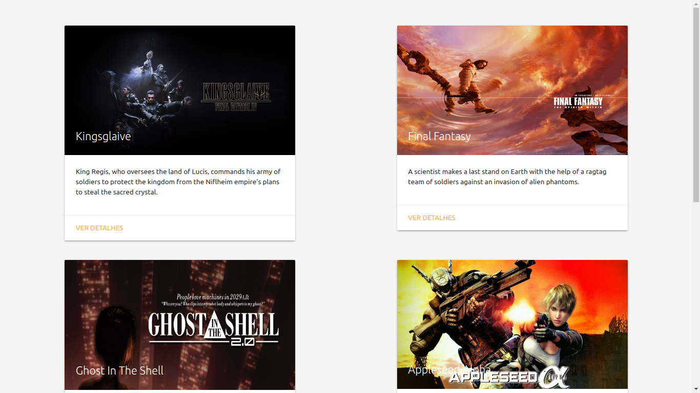

### Termos e acordos

Ao iniciar este projeto, você concorda com as diretrizes do Código de Ética e Conduta e do Manual da Pessoa Estudante da Trybe

# Boas vindas ao repositório do projeto de Movie Cards CRUD!

Você já usa o GitHub diariamente para desenvolver os exercícios, certo? Agora, para desenvolver os projetos, você deverá seguir as instruções a seguir. Fique atento a cada passo, e se tiver qualquer dúvida, nos envie por _Slack_! #vqv 🚀

Aqui você vai encontrar os detalhes de como estruturar o desenvolvimento do seu projeto a partir deste repositório, utilizando uma branch específica e um _Pull Request_ para colocar seus códigos.

# Sumário

- [Habilidades](#habilidades)
- [Entregáveis](#entregáveis)
  - [O que deverá ser desenvolvido](#o-que-deverá-ser-desenvolvido)
  - [Desenvolvimento](#desenvolvimento)
  - [Data de entrega](#data-de-entrega)
- [Instruções para entregar seu projeto](#instruções-para-entregar-seu-projeto)
  - [Antes de começar a desenvolver](#antes-de-começar-a-desenvolver)
  - [Durante o desenvolvimento](#durante-o-desenvolvimento)
- [Como desenvolver](#como-desenvolver)
  - [Nomenclatura](#nomenclatura)
  - [Linter](#linter)
  - [Testes](#testes)
    - [Dica: desativando testes](#dica-desativando-testes)
    - [Dica: watch mode](#dica-watch-mode)
- [Requisitos do projeto](#requisitos-do-projeto)

    `Requisitos Obrigatórios:`
    - [1 - Renderize BrowserRouter no componente App usando rotas](#1-renderize-browserrouter-no-componente-app-usando-rotas)
    - [2 - Faça uma requisição para buscar e mostrar a lista de filmes quando MovieList for montado](#2-faça-uma-requisição-para-buscar-e-mostrar-a-lista-de-filmes-quando-movielist-for-montado)
    - [3 - Insira um link para a página de detalhes de um filme dentro de MovieCard](#3-insira-um-link-para-a-página-de-detalhes-de-um-filme-dentro-de-moviecard)
    - [4 - Faça uma requisição para buscar o filme que deverá ser renderizado dentro de Movie Details](#4-faça-uma-requisição-para-buscar-o-filme-que-deverá-ser-renderizado-dentro-de-movie-details)
    - [5 - Realize uma requisição para buscar o filme que será editado em EditMovie](#5-realize-uma-requisição-para-buscar-o-filme-que-será-editado-em-editmovie)
    - [6 - Insira um link na página inicial para NewMovie para criar novos cartões](#6-insira-um-link-na-página-inicial-para-newmovie-para-criar-novos-cartões)
        
    `Requisitos Bônus:`
    - [7 - Adicione um link para deletar um cartão em MovieDetails](#7-adicione-um-link-para-deletar-um-cartão-em-moviedetails)
- [Depois de terminar o desenvolvimento](#depois-de-terminar-o-desenvolvimento)
- [Revisando um pull request](#revisando-um-pull-request)
- [Avisos Finais](#avisos-finais)

# Habilidades

Nesse projeto, você será capaz de:

- Utilizar o componentDidMount para executar uma ação após o componente ser inserido no DOM;
- Utilizar o shouldComponentUpdate para avaliar se uma atualização do componente deve ou não acontecer naquele momento;
- Utilizar o componentDidUpdate para executar uma ação após o componente ser atualizado;
- Utilizar o componentWillUnmount para realizar uma ação antes de o componente ser desmontado;
- Utilizar o props.children para acessar os filhos de um componente React e interagir com eles;
- Utilizar o componente BrowserRouter corretamente;
- Criar links de navegação na aplicação com o componente Link ;
- Criar rotas, mapeando o caminho da URL com o componente correspondente, via Route ;
- Estruturar e organizar as rotas da sua aplicação com o componente Switch ;
- Usar o componente Redirect pra alternar entre rotas.

# Entregáveis

Para entregar o seu projeto você deverá criar um Pull Request neste repositório.

Lembre-se que você pode consultar nosso conteúdo sobre Git & GitHub sempre que precisar!

---

## O que deverá ser desenvolvido

Dando continuidade aos últimos projetos, você criará um **CRUD** de cartões de filmes em React. 
A sigla **CRUD** significa, _Create, Read, Update and Delete_, então deve ser possível realizar as seguintes operações nesse projeto:

  - Adicionar um novo filme à lista - **CREATE**;
  - Listar todos os filmes cadastrados, com uma página de informações resumidas sobre cada filme e uma página de informações detalhadas de um filme selecionado - **READ**;
  - Editar um filme da lista - **UPDATE**;
  - E apagar um filme da lista - **DELETE**;

## Desenvolvimento

Nos últimos projetos, por mais que o app tenha sido desenvolvido utilizando múltiplos componentes, o que é uma boa prática, todas as funcionalidades eram acessadas ao mesmo tempo, no mesmo lugar, utilizando apenas uma URL (`localhost:3000`, normalmente). Na mesma página onde havia a listagem de filmes, havia um formulário pra criar um novo filme, por exemplo. À medida que seus apps se tornarem maiores e mais complexos, isso se tornará inviável. Desta vez, as funcionalidades do app serão agrupadas e organizadas em rotas.

Uma rota define o que deve ser renderizado na página ao abri-la. Cada rota está associada a um caminho. O caminho é a parte da URL após o domínio (nome do site, de forma simplificada). Por exemplo, em `www.site.com/projetos/meu-jogo`, o caminho é `/projetos/meu-jogo`. Até agora, todos os apps React que você desenvolveu possuíam somente uma rota, a raiz (`/`).

Este app terá 4 rotas:

1. A rota raiz (index), no caminho `/`. Esta rota exibirá uma lista com todos os filmes cadastrados. Essa lista contém informações resumidas sobre cada filme.

2. Uma rota para criar novos filmes, no caminho `/movies/new`. Essa rota renderizará um formulário para adicionar um novo filme.

3. Uma rota para mostrar informações detalhadas de um filme, no caminho `/movies/:id`. Onde o `:id` é o parâmetro da URL que representa o _id_ do filme exibido. Por exemplo, ao entrar no caminho `/movies/5`, serão exibidas informações sobre o filme com _id_ `5`.

4. Uma rota para editar um filme, no caminho `/movies/:id/edit`. Assim como na rota 3, `:id` é o _id_ do filme a ser editado. Essa rota renderizará um formulário idêntico ao da rota 2. Nesse caso, porém, o formulário virá preenchido com as informações do filme a ser editado. Ao submeter o formulário, ao invés de criar um novo filme, o filme em questão terá seus dados atualizados.

Relacionado a cada rota haverá um componente React responsável por renderizar seu conteúdo. Esse mapeamento entre o caminho da URL, rota e componente será feito pelo `React Router`, a principal biblioteca de roteamento em `React`.

Naturalmente, haverá links de navegação e redirecionamento entre as diferentes rotas. Por exemplo, na rota 1 (caminho `/`), haverá, para cada filme, um link para a rota 3 (caminho `/movies/:id`), onde se poderá ver informações detalhadas sobre o filme escolhido. Na rota 3 (caminho `/movies/:id`), haverá um link para a rota 4 (caminho `/movies/:id/edit`), a fim de se editar informações do filme. Ao submeter o formulário, o app automaticamente será levado de volta à rota 3 (caminho `/movies/:id`), mostrando as informações atualizadas do filme. Tudo isso será feito utilizando os componentes da biblioteca `React Router`.

Outra diferença importante neste projeto em relação aos anteriores é que os dados virão de uma API (simulada) e não mais de um arquivo estático. Você utilizará essa API para criar, ler, atualizar e apagar filmes. Logo, você terá que lidar com requisições assíncronas e _promises_. Também deverá fazer uso de _lifecycle methods_ e de estados para controlar o que é renderizado por seus componentes a depender de em que momento as requisições se encontram.

## Data de entrega

  - Serão `2` dias de projeto.
  - Data de entrega para avaliação final do projeto: `17/05/2021 - 14:00h`.

---

# Instruções para entregar seu projeto

## Antes de começar a desenvolver

1. Clone o repositório
  * `git clone https://github.com/tryber/sd-010-b-project-movie-card-library-crud.git`.
  * Entre na pasta do repositório que você acabou de clonar:
    * `cd sd-010-b-project-movie-card-library-crud`

2. Instale as dependências e inicialize o projeto
  * Instale as dependências:
    * `npm install`
  * Inicialize o projeto:
    * `npm start` (uma nova página deve abrir no seu navegador com um texto simples)

3. Crie uma branch a partir da branch `master`
  * Verifique que você está na branch `master`
    * Exemplo: `git branch`
  * Se não estiver, mude para a branch `master`
    * Exemplo: `git checkout master`
  * Agora, crie uma branch onde você vai guardar os `commits` do seu projeto
    * Você deve criar uma branch no seguinte formato: `nome-de-usuario-nome-do-projeto`
    * Exemplo: `git checkout -b joaozinho-project-movie-card-library-crud`

4. Faça alterações em algum dos componentes que precisam de implementação, por exemplo o `App` em `src/`:
```jsx
import React from 'react';
import { BrowserRouter as Router } from 'react-router-dom';
import './App.css';

function App() {
  return (
    <Router>
      <div>Movie Card Library CRUD</div>
    </Router>
  );
}

export default App;
```

5. Adicione as mudanças ao _stage_ do Git e faça um `commit`
  * Verifique que as mudanças ainda não estão no _stage_
    * Exemplo: `git status` (deve aparecer listado o arquivo _src/App.js_ em vermelho)
  * Adicione o arquivo alterado ao _stage_ do Git
      * Exemplo:
        * `git add .` (adicionando todas as mudanças - _que estavam em vermelho_ - ao stage do Git)
        * `git status` (deve aparecer listado o arquivo _src/App.js_ em verde)
  * Faça o `commit` inicial
      * Exemplo:
        * `git commit -m 'iniciando o projeto. VAMOS COM TUDO :rocket:'` (fazendo o primeiro commit)
        * `git status` (deve aparecer uma mensagem tipo _nothing to commit_ )

6. Adicione a sua branch com o novo `commit` ao repositório remoto
  * Usando o exemplo anterior: `git push -u origin joaozinho-project-movie-card-library-crud`

7. Crie um novo `Pull Request` _(PR)_
  * Vá até a página de _Pull Requests_ do [repositório no GitHub](https://github.com/tryber/sd-010-b-project-movie-card-library-crud/pulls)
  * Clique no botão verde _"New pull request"_
  * Clique na caixa de seleção _"Compare"_ e escolha a sua branch **com atenção**
  * Clique no botão verde _"Create pull request"_
  * Adicione uma descrição para o _Pull Request_ e clique no botão verde _"Create pull request"_
  * **Não se preocupe em preencher mais nada por enquanto!**
  * Volte até a [página de _Pull Requests_ do repositório](https://github.com/tryber/sd-010-b-project-movie-card-library-crud/pulls) e confira que o seu _Pull Request_ está criado


---

## Durante o desenvolvimento

* ⚠ **PULL REQUESTS COM ISSUES NO LINTER NÃO SERÃO AVALIADAS, ATENTE-SE PARA RESOLVÊ-LAS ANTES DE FINALIZAR O DESENVOLVIMENTO!** ⚠

* ⚠ **LEMBRE-SE DE CRIAR TODOS OS ARQUIVOS DENTRO DA PASTA COM O SEU NOME** ⚠

* Faça `commits` das alterações que você fizer no código regularmente;

* Lembre-se de sempre após um ~~(ou alguns)~~ `commits` atualizar o repositório remoto (o famoso `git push`);

* Os comandos que você utilizará com mais frequência são:

  1. `git status` _(para verificar o que está em vermelho - fora do stage - e o que está em verde - no stage)_;

  2. `git add` _(para adicionar arquivos ao stage do Git)_;

  3. `git commit` _(para criar um commit com os arquivos que estão no stage do Git)_;

  4. `git push -u nome-da-branch` _(para enviar o commit para o repositório remoto na primeira vez que fizer o `push` de uma nova branch)_;

  5. `git push` _(para enviar o commit para o repositório remoto após o passo anterior)_.

---

# Como desenvolver

Este repositório já contém um _template_ com um App React criado. Após clonar o projeto e instalar as dependências (mais sobre isso abaixo), você deverá completar este _template_ implementando os requisitos listados na próxima seção.

---

## Nomenclatura 

**ATENÇÃO!** Muito cuidado com os nomes especificados nos requisitos! O conteúdo deve ser **exatamente igual** ao texto descrito no requisito. Em alguns componentes foram colocadas propriedades chamadas _data-testid_ que, sob nenhuma hipótese devem ser alteradas. Os detalhes acima tem implicação direta no funcionamento do avaliador.

Os testes foram desenvolvidos dessa forma para permitir uma maior liberdade para estruturar e estilizar a página, portanto, abusem da criatividade! 😉

**⚠️ Adicione PropTypes a todos os componentes ⚠️**

Todos os componentes que recebem _props_ devem ter suas _PropTypes_ corretamente declaradas. O _eslint_ checa automaticamente declaração de _PropTypes_, portanto seu _Pull Request_ só receberá nota se elas estiverem feitas.

---

## Linter

Para garantir a qualidade do código, vamos utilizar neste projeto os linters `ESLint` e `StyleLint`.
Assim o código estará alinhado com as boas práticas de desenvolvimento, sendo mais legível
e de fácil manutenção! Para roda-los localmente no projeto, execute os comandos abaixo:

```bash
npm run lint
npm run lint:styles
```

⚠️ **PULL REQUESTS COM ISSUES DE LINTER NÃO SERÃO AVALIADAS.
ATENTE-SE PARA RESOLVÊ-LAS ANTES DE FINALIZAR O DESENVOLVIMENTO!** ⚠️

---

## Testes

Todos os requisitos do projeto serão testados **automaticamente**. Cada componente possui vários requisitos e os testes para cada requisito de um componente estão no arquivo de teste correspondente.

_**Por exemplo**: Os requisitos relacionados à página `EditMovie` estão no arquivo `EditMovie.test.js`._

Para executar os testes localmente, digite no terminal o comando `npm test`.

### Dica: desativando testes

Especialmente no início, quando a maioria dos testes está falhando, a saída após executar os testes é bastante poluída. Você pode desabilitar temporariamente um teste utilizando a função `skip` junto à função `it`. Como o nome indica, esta função "pula" um teste:

```js
it.skip('it includes the text `Movie Cards Library` inside a h1 tag', () => {
  wrapper = shallow(<Header />);

  expect(wrapper.find('header h1').text()).toBe('Movie Cards Library');
});
```

Uma estratégia é pular todos os testes no início e ir implementando um teste de cada vez, removendo dele a função `skip`.

Você também pode rodar apenas um arquivo de teste, por exemplo:

```bash
npm test SearchBar.test.js
```

⚠️ Lembre-se de não entregar o projeto com nenhum teste ignorado. **Testes ignorados serão tratados como testes falhando**. ⚠️

⚠️ **Não apague, em hipótese alguma, qualquer teste ou arquivo deste repositório**. ⚠️

---

### Dica: watch mode

Ao executar os testes localmente, [Jest](https://jestjs.io/), a ferramenta que executa os testes, entra em _watch mode_. Nesse modo, a cada vez que um arquivo é salvo, os testes são executados novamente. Isso pode aumentar sua produtividade removendo a necessidade de executar os testes manualmente o tempo todo. Você pode abrir uma aba no seu terminal ou no terminal do _VSCode_ e deixar o _Jest_ rodando nesse modo.

⚠️  **Este trabalho contém alguns testes de componente não relacionados diretamente a requisitos! Estude-os e use-os para se orientar durante o desenvolvimento, garantindo que estejam sempre passando** ✅! ⚠️

---

## Requisitos do projeto

### 1 - Renderize `BrowserRouter` no componente `App` usando rotas

Você deve utilizar um `BrowserRouter` pra criar as rotas da sua aplicação. As urls de cada página devem ser desenvolvidas conforme especificado na seção _O que será desenvolvido_.

#### O que será verificado:

- Será validado se a rota `/` renderiza a página MovieList

- Será validado se a rota `/movies/:id` renderiza a página MovieDetails

- Será validado se a rota `/movies/new` renderiza a página NewMovie

- Será validado se a rota `/movies/:id/edit` renderiza a página EditMovie

- Será validado se qualquer rota não declarada renderiza a página NotFound


### 2 - Faça uma requisição para buscar e mostrar a lista de filmes quando `MovieList` for montado 

Para buscar a lista, você deve utilizar a função `getMovies` importada do módulo `movieAPI` em `MovieList`. Essa função retorna uma _promise_. A requisição deve ser feita no momento em que o `MovieList` for montado no DOM. Enquanto a requisição estiver em curso, `MovieList` deve renderizar o componente `Loading`, como ilustrado na imagem a seguir.


Obs: O componente `Loading` deve conter o texto `Carregando...`

Uma vez que a requisição retornar, o resultado deve ser renderizado. Para cada filme, renderize um componente `MovieCard`, como ilustrado abaixo.



Você precisará adicionar um estado em `MovieList` para controlar o que será exibido.


#### O que será verificado:

- Será validado se a página `MovieList` exibe o texto `Carregando...` enquanto estiver fazendo a requisição

- Será validado se a página `MovieList` exibe um `MovieCard` para cada filme retornado pela API


### 3 - Insira um link para a página de detalhes de um filme dentro de `MovieCard`

Todos os `MovieCard`s devem possuir em seu conteúdo, pelo menos, o título, a sinopse e um link com o texto "VER DETALHES" que aponta para a rota `movies/:id`, onde `:id` é o id do filme. Esta rota exibirá informações detalhadas de um filme.

#### O que será verificado:

- Será validado se cada `MovieCard` exibe pelo menos o título e a sinopse de seu respectivo filme

- Será validado se cada `MovieCard` contém um link com o texto `VER DETALHES` que redireciona para a página de detalhes do filme


### 4 - Faça uma requisição para buscar o filme que deverá ser renderizado dentro de `Movie Details`

`MovieDetails` se comporta de forma muito semelhante ao `MovieList`. Ao ser montado, deve fazer uma requisição utilizando a função `getMovie`, se atente para o nome da função que é muito semelhante ao de outra função que já utilizamos, a `getMovies`, do módulo `movieAPI`, passando o id do filme. O componente `Loading` deve ser renderizado enquanto a requisição estiver em curso. Após terminar, deve-se renderizar um card com mais detalhes sobre o filme, contendo:

  - Uma `` com a imagem do filme e `alt='Movie Cover'`;
  - Título;
  - Subtítulo;
  - Sinopse;
  - Gênero;
  - Avaliação;
  - um link com o texto "EDITAR" apontando para a rota `/movies/:id/edit` e um link apontando para a rota raiz (`/`) com o texto "VOLTAR".

Os campos devem existir no cartão conforme ilustrado na imagem abaixo.

#### O que será verificado:

- Será validado se `MovieDetails` exibe o texto "Carregando..." enquanto estiver fazendo a requisição

- Será validado se `MovieDetails` exibe o título, o subtítulo, a sinopse, a imagem e o gênero do filme

- Será validado se `MovieDetails` contém um botão com o texto "VOLTAR" que redireciona para a página inicial

- Será validado se `MovieDetails` contém um botão com o texto "EDITAR" que redireciona para a página de edição de filme


### Para os requisitos 5 e 6:

Para correta avaliação, os campos do formulário devem possuir as seguintes tags `<label>` e  tipos de entrada:
- label: 'Título', entrada: tag `<input>` de tipo 'text'
- label: 'Subtítulo', entrada: tag `<input>` de tipo 'text'
- label: 'Imagem', entrada: tag `<input>` de tipo 'text'
- label: 'Sinopse', entrada: tag `<textarea>`
- label: 'Gênero', entrada: tag `<select>`, com as seguintes opções:
    - `<option value="action">Ação</option>`
    - `<option value="comedy">Comédia</option>`
    - `<option value="thriller">Suspense</option>`
    - `<option value="fantasy">Fantasia</option>`
- label: 'Avaliação', entrada: tag `<input>`, de tipo 'number' com valores que vão de 0 (mínimo) a 5 (máximo), com um step de 0.1.

Obs: O conteúdo das tags `<label>` devem estar idênticos ao específicado acima. Importante associar corretamente todas as suas entradas e labels!

### 5 - Realize uma requisição para buscar o filme que será editado em `EditMovie`

Ao ser montada, a página de edição do filme deve fazer uma requisição pra buscar o filme que será editado e deve, ao ter seu formulário submetido, atualizar o filme e redirecionar a página pra rota raíz.

#### O que será verificado:

- Será validado se `EditMovie` exibe o texto "Carregando..." enquanto estiver fazendo a requisição
- Será validado se `EditMovie` contém um formulário preenchido com o título, subtítulo, sinopse, caminho da imagem e gênero do filme selecionado

- Será validado se, ao clicar no botão de submit, uma requisição para API é feita e o filme selecionado é atualizado. Após a conclusão da atualização a pessoa usuária deve ser redirecionada para a página inicial


### 6 - Insira um link na página inicial para `NewMovie` para criar novos cartões

O link deve conter o texto "ADICIONAR CARTÃO" e apontar para a rota `/movies/new`, contendo um formulário para criar novos cartões.

Na rota `/movies/new`, utilizando a callback passada para `MovieForm`, `NewMovie` deve criar um novo cartão utilizando a função `createMovie` do módulo `movieAPI`. Após o fim da requisição, `NewMovie` deve redirecionar o app para a página inicial, contento o novo cartão.

#### O que será verificado:

- Será validado se a página inicial contém um link "ADICIONAR CARTÃO". Esse link deve redirecionar para a página de criação de filmes

- Será validado se `NewMovie` contém um formulário que faz uma requisição para API para criar um novo filme. Após a criação, a pessoa usuária deverá ser redirecionada para a página inicial


#### Requisitos bônus:

### 7 - Adicione um link para deletar um cartão em `MovieDetails`

Ao clicar neste link, faça uma requisição utilizando a função `deleteMovie` do módulo `movieAPI`. Após finalizar a requisição, redirecione o app para a página inicial. O cartão apagado não deverá mais se encontrar na lista.

#### O que será verificado:

- Será validado se `MovieDetails` contém um link com o texto "DELETAR"

- Será validado se o link "DELETAR" faz uma requisição para a API para excluir o filme em questão

---

## Depois de terminar o desenvolvimento (opcional)

Para sinalizar que o seu projeto está pronto para o _"Code Review"_ dos seus colegas, faça o seguinte:

* Vá até a página **DO SEU** _Pull Request_, adicione a label de _"code-review"_ e marque seus colegas:

  * No menu à direita, clique no _link_ **"Labels"** e escolha a _label_ **code-review**;

  * No menu à direita, clique no _link_ **"Assignees"** e escolha **o seu usuário**;

  * No menu à direita, clique no _link_ **"Reviewers"** e digite `students`, selecione o time `tryber/students-sd-00`.

Caso tenha alguma dúvida, [aqui tem um video explicativo](https://vimeo.com/362189205).

---

## Revisando um pull request

Use o conteúdo sobre [Code Review](https://course.betrybe.com/real-life-engineer/code-review/) para te ajudar a revisar os _Pull Requests_.

---

# Avisos finais

Ao finalizar e submeter o projeto, não se esqueça de avaliar sua experiência preenchendo o formulário. Leva menos de 3 minutos!

Link: [FORMULÁRIO DE AVALIAÇÃO DE PROJETO](https://bit.ly/3ta7hA0)

O avaliador automático não necessariamente avalia seu projeto na ordem em que os requisitos aparecem no readme. Isso acontece para deixar o processo de avaliação mais rápido. Então, não se assuste se isso acontecer, ok?
